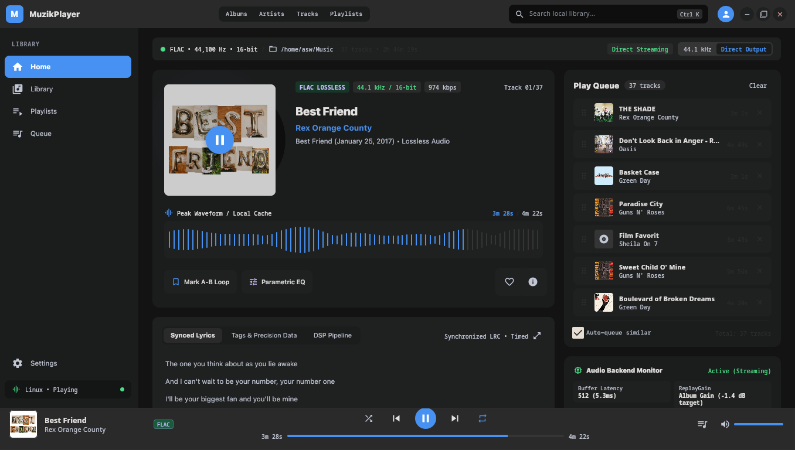
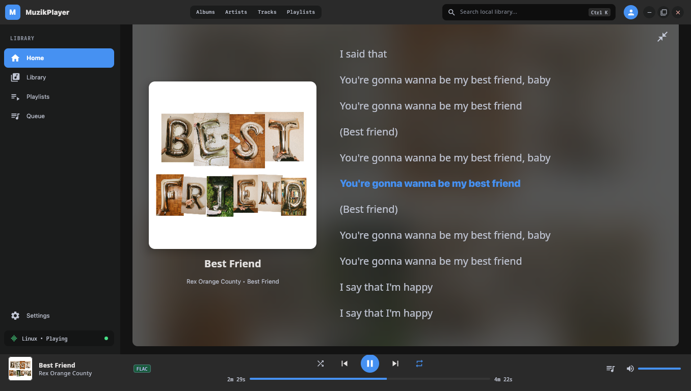
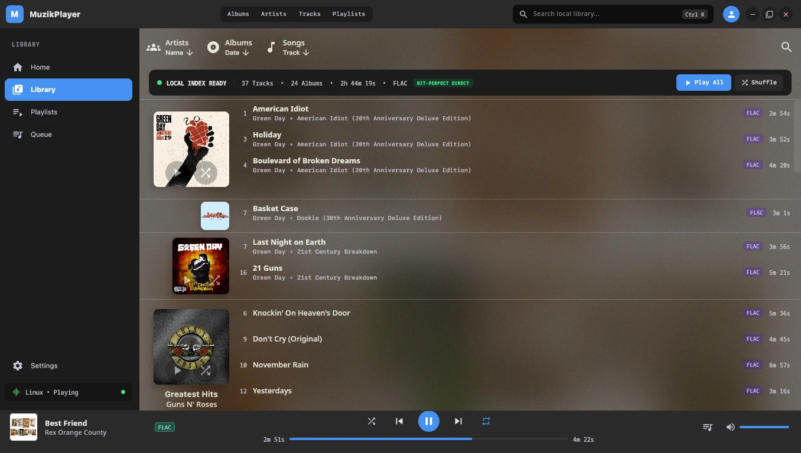
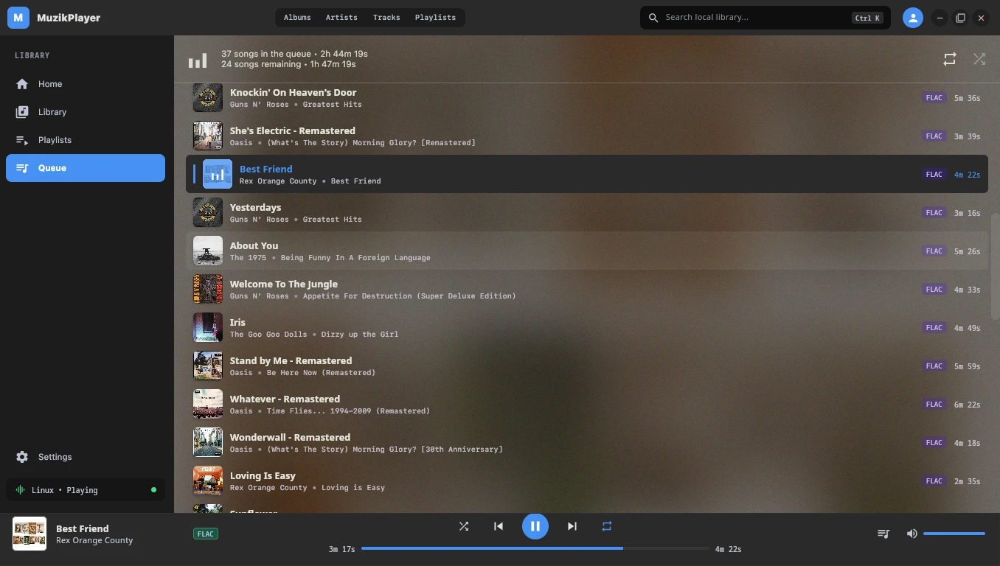

# MuzikPlayer Release Guide

This project uses Flatpak as its primary Linux release format. The
application version lives in exactly one place: `version = "..."` in
`src/build.gradle.kts`. Every other reference to it (README.md's install
examples and "Version:" field) is derived from that value by
`scripts/bump-version.sh` — never hand-edit a version string anywhere else.

## Before releasing

1. Run `./scripts/bump-version.sh <new-version>` from the repo root. This
   updates `src/build.gradle.kts` and every hardcoded version string in
   README.md, and reminds you to add a CHANGELOG.md entry (which it does not
   write for you, since changelog prose needs a human).
2. Check the working tree and whitespace:

   ```bash
   git status
   git diff --check
   ```

3. Run the tests:

   ```bash
   cd src
   ./gradlew test
   ```

## Build the native release application

From `src/`:

```bash
./gradlew createReleaseDistributable
```

The application directory is `src/build/compose/binaries/main-release/app/MuzikPlayer/`.
Run it with:

```bash
build/compose/binaries/main-release/app/MuzikPlayer/bin/MuzikPlayer
```

Compose Desktop may also create host-native packages:

```bash
./gradlew packageDeb
./gradlew packageRpm
```

Compose's "app image" is only the unpacked application directory
(`createReleaseDistributable` above), not a single-file `.AppImage`, so
releases ship `.deb`, `.rpm`, and the portable `.tar.gz` instead.

Packages are written below `src/build/compose/binaries/main-release/`.
With the Linux targets enabled in `src/build.gradle.kts`, the release package
tasks are:

```bash
./gradlew packageReleaseDeb
./gradlew packageReleaseRpm
```

The resulting `.deb` and `.rpm` files are placed under
`src/build/compose/binaries/main-release/`. These tasks require a clean JDK
installation because Compose uses `jlink` to create the bundled runtime.

## Build and install Flatpak locally

Install the required tools and runtime once:

```bash
flatpak install flathub \
  org.freedesktop.Platform//26.08 \
  org.freedesktop.Sdk//26.08
```

Flatpak metadata and assets live in `src/flatpak/`: the manifest, desktop
launcher, AppStream metadata, and SVG/PNG application logos.

Then, from `src/`, run `./flatpak/build.sh`. This builds the release application
and installs the Flatpak for the current user.

Run the installed app:

```bash
flatpak run io.github.coderaulia.MuzikPlayer
```

Remove the local installation with:

```bash
flatpak uninstall --user io.github.coderaulia.MuzikPlayer
```

## Create a shareable `.flatpak` bundle

After `flatpak-builder` and the runtime/SDK are available:

```bash
cd src
./gradlew createReleaseDistributable
flatpak-builder --user --repo=repo --force-clean build-dir \
  flatpak/io.github.coderaulia.MuzikPlayer.yml
flatpak build-bundle repo MuzikPlayer-VERSION.flatpak \
  io.github.coderaulia.MuzikPlayer VERSION
```

Replace `VERSION` with the current `version = "..."` value in `src/build.gradle.kts`.
Test the bundle before distributing it:

```bash
flatpak install --user MuzikPlayer-VERSION.flatpak
flatpak run io.github.coderaulia.MuzikPlayer
```

## Commit the release

After testing the artifact:

```bash
git diff --check
git add src/build.gradle.kts RELEASE.md
git commit -m "Prepare MuzikPlayer VERSION release"
```

Replace `VERSION` in the commit message with the actual version. Do not push
until the release has been manually tested and approved.

## Current environment note

The Flatpak workflow requires both `flatpak` and `flatpak-builder`. The release
task also requires a clean JDK because `jlink` rejects modified files under the
JDK security configuration. If the Gradle wrapper cache is read-only, set
`GRADLE_USER_HOME` to a writable directory before building.

## Screenshots

Reference screenshots for release notes and store listings live in `src/screenshots/`:





